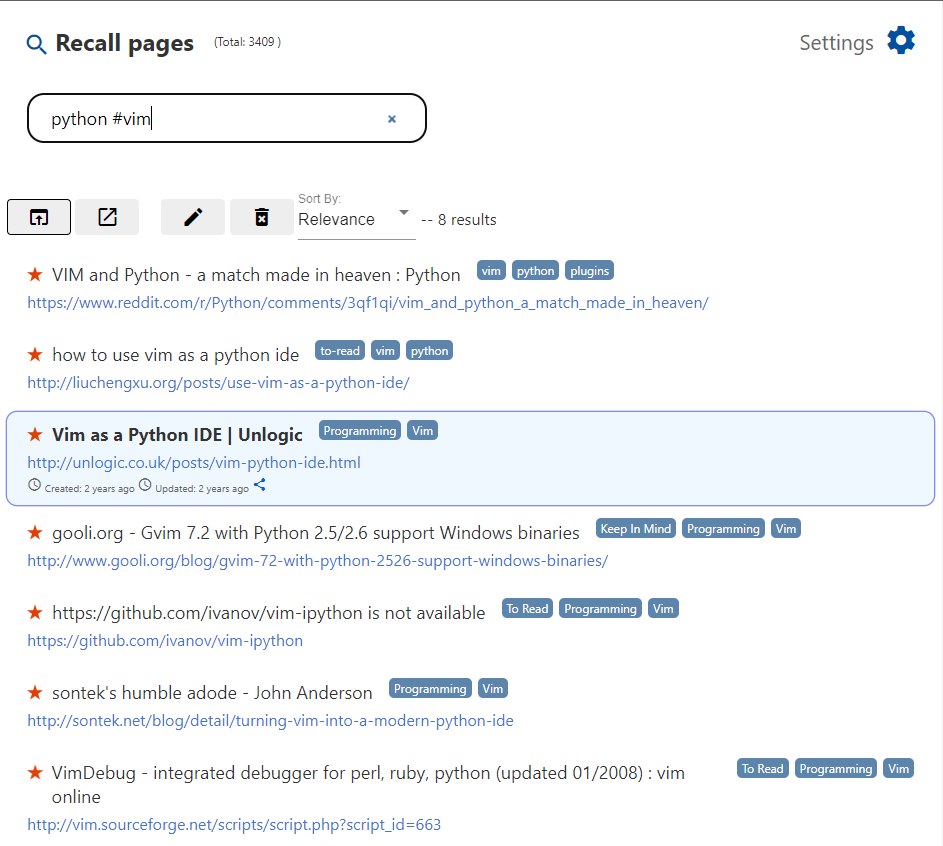

# Total Recall

A cross-browser bookmarking and quick-launch extension for power users.

- Instantly bookmark and search using only the keyboard.
- Synchronize your bookmarks across browsers
- Support for tags

## Features

- Full-text search + tags search using hashtag syntax (`#mytag`)
- Uses CouchDB for open-protocol synchronization across devices
- Official CouchDB server with https access, maintained for free
	- Users may sync to their own private CouchDB server instead
- Export and import your database to and from a local JSON file.

**Built with:**
- Svelte for UI
- FlexSearch for fast searching
- PouchDB for persistence and synchronization

## How to use

- Press `Ctrl+Shift+K` to bookmark the current page
	- Edit the bookmark, and press `Enter` to confirm
	- Press `Escape` to cancel bookmark

- Press `Ctrl+Shift+F` to open search, and start typing!
	- Navigate the results using `Up`/`Down`/`Page Up`/`Page Down`/`Home`/`End`
	- Press `Enter` to go to selected page(s)
	- Press `Ctrl+Enter` to open the selected pages in new tabs
	- Press `Shift+Enter` to open the selected pages in a new window
	- Press `Insert` to edit the bookmarks for the selected pages
	- Press `Delete` to delete the bookmarks for the selected pages

## Backup & Syncronization

Replication (sync) is disabled by default, but can be enabled by the user.

There are two replication options:

- **Sync to TotalRecall free server** - Will sync to a dedicated server that we provide for free.
	- Data is sent securely over https.
	- We will never share your data (i.e. bookmarks) with anyone, without your permission.
- **Sync to custom CouchDB** - Will sync to any CouchDB that has a public URL.
	- CouchDB databases are very easy to set up. (We highly recommend [Caddy](https://caddyserver.com/) as an SSL front).

## Screenshot

